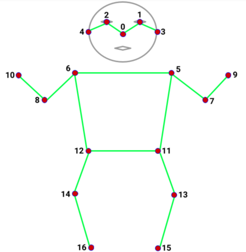
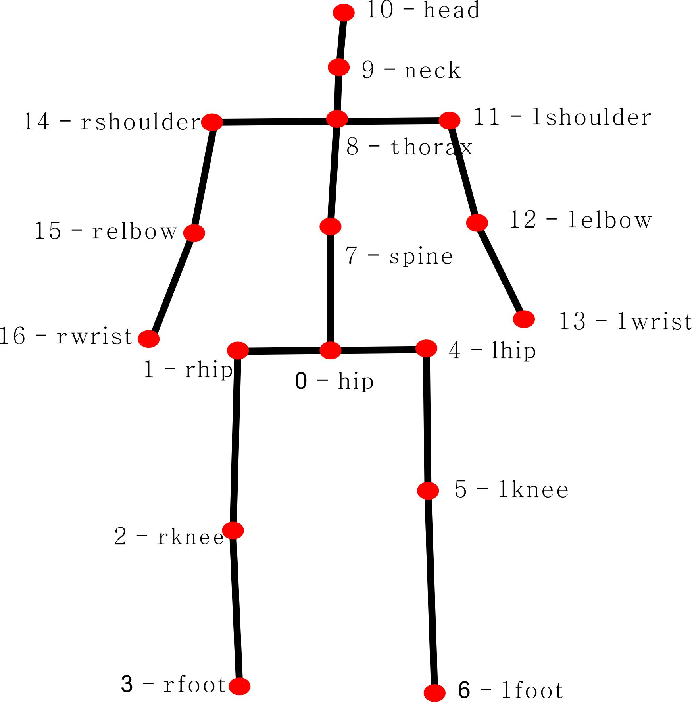

## Keypoint Diagram
See the diagram below for what those keypoints are and their index in the array.

### COCO Keypoints: Used in MoveNet and PoseNet

0: nose  \
1: left_eye  \
2: right_eye  \
3: left_ear  \
4: right_ear  \
5: left_shoulder  \
6: right_shoulder  \
7: left_elbow  \
8: right_elbow  \
9: left_wrist  \
10: right_wrist  \
11: left_hip  \
12: right_hip  \
13: left_knee  \
14: right_knee  \
15: left_ankle  \
16: right_ankle

### BlazePose Keypoints: Used in MediaPipe BlazePose

0: nose  \
1: left_eye_inner \
2: left  \
3: left_eye_outer  \
4: right_eye_inner  \
5: right_eye  \
6: right_eye_outer  \
7: left_ear  \
8: right_ear  \
9: mouth_left  \
10: mouth_right  \
11: left_shoulder  \
12: right_shoulder  \
13: left_elbow  \
14: right_elbow  \
15: left_wrist  \
16: right_wrist  \
17: left_pinky  \
18: right_pinky  \
19: left_index  \
20: right_index  \
21: left_thumb  \
22: right_thumb  \
23: left_hip  \
24: right_hip  \
25: left_knee  \
26: right_knee  \
27: left_ankle  \
28: right_ankle  \
29: left_heel  \
30: right_heel  \
31: left_foot_index  \
32: right_foot_index

### human3.6m

| 序号 | 数据集标注顺序 | 关节名    | 中文名 |
| ---- | -------------- | --------- | ------ |
| 0    | 0              | hip       | 臀部   |
| 1    | 1              | rhip      | 右臀部 |
| 2    | 2              | rknee     | 右膝盖 |
| 3    | 3              | rfoot     | 右脚踝 |
| 4    | 6              | lhip      | 左臀部 |
| 5    | 7              | lknee     | 左膝盖 |
| 6    | 8              | lfoot     | 左脚踝 |
| 7    | 12             | spine     | 脊柱   |
| 8    | 13             | thorax    | 胸部   |
| 9    | 14             | neck      | 颈部   |
| 10   | 15             | head      | 头部   |
| 11   | 17             | lshoulder | 左肩   |
| 12   | 18             | lelbow    | 左手肘 |
| 13   | 19             | lwrist    | 左手腕 |
| 14   | 25             | rshoulder | 右肩   |
| 15   | 26             | relbow    | 右手肘 |
| 16   | 27             | rwrist    | 右手腕 |
